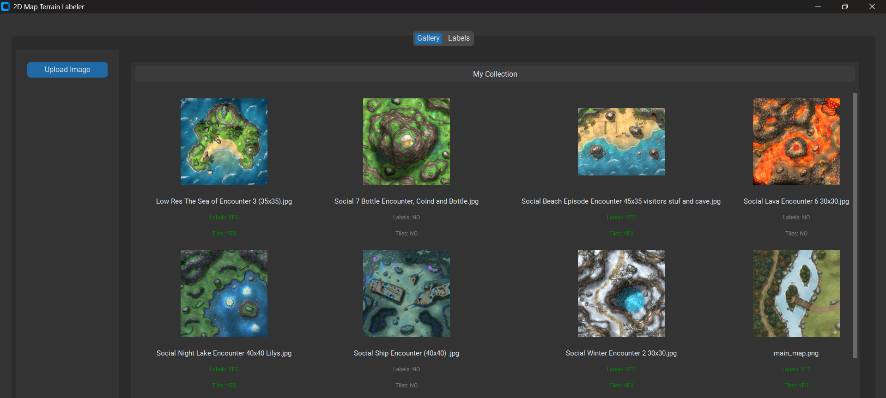
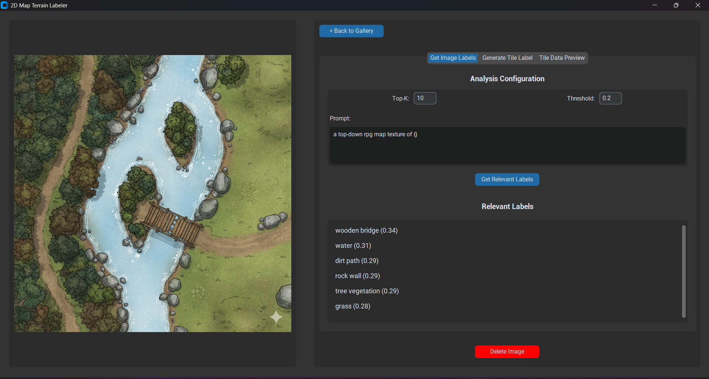
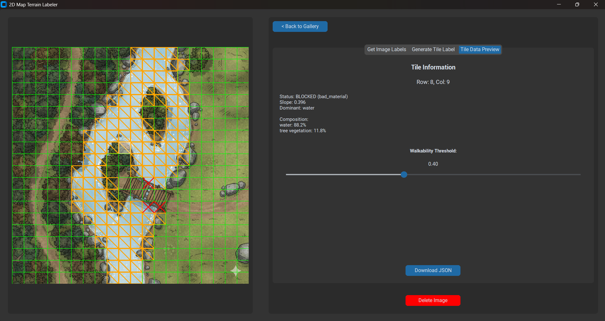

# AI Terrain Labeler & Tile Generator

A machine learning-powered tool for analyzing top-down RPG map images, identifying terrain types, and generating grid-based tile data with walkability and slope information.
<br>
<p>
  <strong>🎥 Learn how to use the tool by watching this video here:</strong>
</p>

https://github.com/user-attachments/assets/4760f5f4-9b95-45c4-99fa-223affbbd418

**Main Application Interface**



## Features

-   **Image Gallery**: Manage your collection of map textures/images.
-   **AI Labeling**: Uses OpenAI's CLIP model to automatically identify relevant terrain labels (e.g., "grass", "water", "rock") from a user-defined list.
-   **Tile Generation**:
    -   **Material Analysis**: Uses CLIPSeg to segment the image into material types.
    -   **Geometry Analysis**: Uses Depth Anything V2 to estimate depth and calculate slope.
    -   **Grid Processing**: Divides the image into a configurable grid (rows/cols).
-   **Walkability Logic**: Determines tile walkability based on:
    -   Dominant material (e.g., Water is unwalkable).
    -   Slope steepness (e.g., Cliffs are unwalkable).
    -   Configurable thresholds.
-   **Interactive Preview**: Visualize the grid, material maps, slope maps, and walkability status in real-time.
-   **JSON Export**: Export the generated tile data for use in game engines (Godot, Unity, etc.).
-   **Storage**: Uses ZODB to save images, labels, and analysis results locally.

## Installation

You can install the dependencies either for the entire repository (recommended if working with multiple tools) or just for this specific tool.

### Option 1: Entire Repository (Recommended)

This project uses `uv` for dependency management.

1.  **Install uv**: [Documentation](https://github.com/astral-sh/uv)
2.  **Sync Dependencies**:
    From the root of the repository (`DnD-ML`), run:
    ```bash
    uv sync
    ```
3.  **Run the Tool**:
    ```bash
    uv run src/terrain_labeling/main.py
    ```

### Option 2: Local Installation (Tool Only)

If you prefer to install dependencies manually for just this tool:

1.  **Install Dependencies**:
    Ensure you have Python 3.8+ installed.

    ```bash
    pip install customtkinter torch transformers pillow matplotlib ZODB numpy
    ```

    *Note: For GPU acceleration, ensure you install the appropriate version of `torch` for your system (CUDA/ROCm).*

2.  **Run the Tool**:
    Navigate to the `src/terrain_labeling` directory and run:
    ```bash
    python main.py
    ```

## Usage

1.  **Run the Application**:
    Navigate to the `src/terrain_labeling` directory and run:

    ```bash
    python main.py
    ```

2.  **Workflow**:
    -   **Gallery Tab**: Upload a top-down map image.
    -   **Labels Tab**: Define your terrain types (e.g., "Grass", "Stone", "Lava") and set their default walkability and slope tolerance.
    -   **Detail View (Click an image)**:
        
        -   **Get Image Labels**: Run the analysis to see which of your defined labels are present in the image.
        -   **Generate Tile Data**: Configure the grid size (e.g., 20x20) and generate the tile data.
        -   **Tile Data Preview**: Inspect individual tiles. Adjust the global walkability threshold to see how it affects the map.
            
        -   **Download JSON**: Export the data.

## Project Structure

-   `main.py`: Entry point.
-   `ui/`: CustomTkinter user interface components.
-   `ml/`: Machine learning logic (CLIP, CLIPSeg, Depth).
-   `core/`: Database (ZODB) and Data Models.

## Technologies

-   **UI**: CustomTkinter
-   **ML**: PyTorch, Transformers (Hugging Face)
-   **Database**: ZODB (Object Database)

